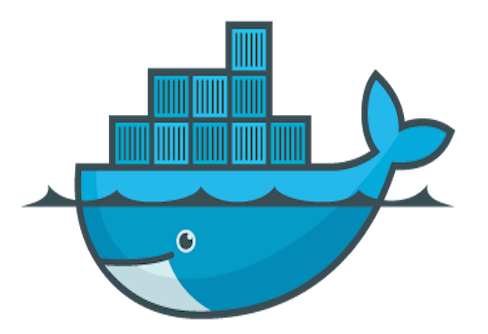
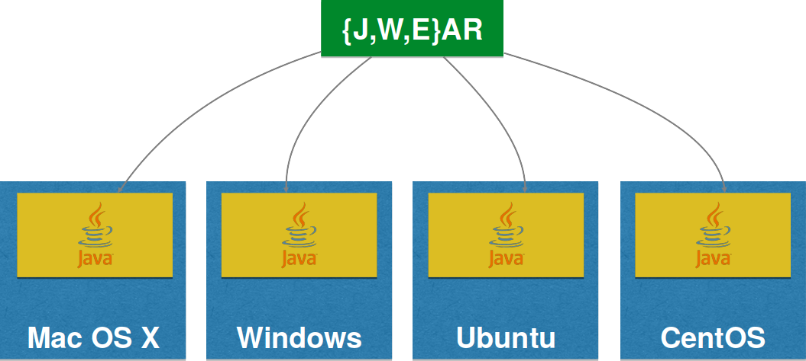

include::includes/_settings.adoc[]

:revealjs_theme: sobkowiak-cg-craftsmanship
:speaker: Krzysztof Sobkowiak (http://twitter.com/ksobkowiak[@ksobkowiak])
:speaker-title: The Apache Software Foundation Member, Senior Solution Architect at Capgemini
:speaker-email: krzysztof.sobkowiak@capgemini.com
:speaker-blog: http://krzysztof-sobkowiak.net
:speaker-twitter: http://twitter.com/ksobkowiak[@ksobkowiak]

= Craftsmanship Open Community Session #2

[.cover]
--

[.event]
Capgemini Craftsmanship Community +
Wrocław, 28th of April 2017

[.newline]
{speaker}
[.speaker-title]
The Apache Software Foundation Member +
Senior Solution Architect at Capgemini
[.logo-left]
image:{template-images-dir}/feather.png[width="60", link="http://apache.org"]
--

// ***************************************************************************
include::includes/about.adoc[]
include::includes/disclaimer-cg.adoc[]
// ***************************************************************************

// ----------------------------------------------------------------------------

== AppsEvolve Summit Report

// ----------------------------------------------------------------------------

=== !

image::images/apps-evolve-2017-photo.png[align="center"]

* Mörfelden, 23-25 March 2017

// ----------------------------------------------------------------------------

=== !

[.noredheader,cols="48%,4%,48%"]
|===
.^a|
* Service Orchestration Stream
** Capgemini EiPaaS -- current state
** PaaS Shootout (EiPaaS, PCF, OpenShift, Fabric8)
* devonfw -- a year after AppsEvolve 2016
a|
.^a|image::images/comming-soon.png[align="center",width="100%"]
|
|===

// ----------------------------------------------------------------------------

// ----------------------------------------------------------------------------

== Fabric8 your Services with Kubernetes & OpenShift

// ----------------------------------------------------------------------------

=== !

image::images/turbo-camel.png[align="center"]

// ----------------------------------------------------------------------------

=== !

[.medium-text]
Creating business value through software is about speed, safety, iteration, and continuous improvement

// ----------------------------------------------------------------------------

=== !

[.noredheader,cols="38%,4%,58%"]
|===
^.^| 
a|
.^a|
* Simple configuration
* Curated dependencies and transitive dependencies
* Built in metrics, monitoring
* Slim profile for deployment (...micro even?)
+
#microprofile
|
|===

// ----------------------------------------------------------------------------

=== !

[.noredheader,cols="48%,4%,48%"]
|===
^.^| image:images/netflix-java-logo.png[width="70%"]
a|
^.^a|
* Distributed configuration
* Service Discovery
* Loadbalancing
* Circuit Breakers
* Bulkheading
* Versioning/Routing
* Based on AWS
|
|===

// ----------------------------------------------------------------------------

=== !

// ----------------------------------------------------------------------------

=== What is Docker?

[.noredheader,cols="50%,4%,46%"]
|===
^.<a|
* Open source project and company (not 100% true)
+
image::images/docker-github.png[width="1500", align="center"]
* Used to create containers for software applications

[source,dockerfile]
----
FROM openjdk

COPY target/hello.jar /usr/src/hello.jar

CMD java -cp /usr/src/hello.jar org.example.App
----

[source,bash]
----
$ docker build -t username/hello
$ docker run -it -p 8080:8080 username/hello
----

a|
^.<a|
* WORA = Write Once Run Anywhere

* PODA = Package Once Deploy Anywhere

image::images/poda.png[align="center", width="70%"]
|
|===

// ----------------------------------------------------------------------------

=== Additional Docker Components

[.noredheader,cols="48%,4%,48%"]
|===
.<a|
* Docker Compose

[source,yaml]
----
version: “3”
services:
  db:
    image: couchbase:latest
    ports:
      - 8091:8091
      - 8092:8092
      - 8093:8093
      - 11210:11210
  web:
    image: username/hello:latest
    environment:
      - COUCHBASE_URI=db
    ports:
      - 8080:8080
----

[source,bash]
----
$ docker-compose up -d
----

a|
.<a|
* Docker Machine
[source,bash]
----
docker-machine create --driver=virtualbox myhost
----

|
|===

// ----------------------------------------------------------------------------

=== DevOps challenges for multiple containers

[.noredheader,cols="48%,4%,48%"]
|===
.<a|
* How to scale?
* How to avoid port conflicts?
* How to manage them in multiple hosts?
* What happens if a host has a trouble?
a|
.<a|
* How to keep them running?
* How to update them?
* Where are my containers?
|
|===

// ----------------------------------------------------------------------------

=== Netflix -- What about non-java?

image::images/non-java-languages.png[align="center", width="50%"]

// ----------------------------------------------------------------------------

=== Swarm Mode

[.noredheader,cols="48%,4%,48%"]
|===
.^a|
* New in 1.12
* Natively managing a cluster of Docker Engines called a Swarm
* Docker CLI to create a swarm, deploy apps, and manage swarm
** Optional feature, need to be explicitly enabled
* No Single Point of Failure (SPOF)
* Declarative state model
* Self-organizing, self-healing
* Service discovery, load balancing and scaling
* Rolling updates
a|
.^a|image::images/docker-swarm-mode-logo.png[align="center", width="60%"]
|
|===

// ----------------------------------------------------------------------------

=== Swarm Mode

[.noredheader,cols="48%,4%,48%"]
|===
.^a|image::images/swarm-mode-replicated-service.png[align="center", width="100%"]
[source,bash]
----
$ docker service create --replicas 2 --name web jboss/wildfly
$ docker service scale web=3
----
a|
.^a|
[source,yaml]
----
version: “3”
services:
  web:
    image: jboss/wildfly
    environment:
      - COUCHBASE_URI=db
    ports:
      - 8080:8080
    deploy:
      replicas: 3
      update_config:
        parallelism: 2
      restart_policy:
        condition: on-failure
----

[source,bash]
----
$ docker stack deploy --compose-file=docker-compose.yml web
----
|
|===

// ----------------------------------------------------------------------------

=== Kubernetes

[.noredheader,cols="48%,4%,48%"]
|===
.^a|image::images/kubernetes-logo.png[align="center", width="40%"]
a|
.^a|
* Container orchestrator
* Supports multiple cloud and bare-metal environments
* Inspired by Google’s experience with containers
* Provides:
** Distributed configuration
** Service Discovery, Loadbalancing
** Versioning/Routing
** Deployments, Scaling/Autoscaling
** Liveness/Health checking, Self healing
|
|===

// ----------------------------------------------------------------------------

=== Kubernetes Concepts

Pods:: colocated group of containers that share an IP, namespace, storage volume, resources, lifecycle
Replica Set:: manages the lifecycle of pods and ensures specified number are running (next gen Replication Controller)
Service:: Single, stable name for a set of pods, also acts as LB
Label:: used to organize and select group of objects

// ----------------------------------------------------------------------------

=== Kubernetes Concepts

[.noredheader,cols="60%,2%,38%"]
|===
.^a|
Node:: Machine or VM in the cluster
Master:: Central control plane, provides unified view of the cluster
* etcd: distributed key-value store used to persist Kubernetes system state
Worker:: Docker host running kubelet (node agent) and proxy services
* Runs pods and containers
a|
.^a|
image::images/kubernetes-master.png[align="right", width="70%"]
image::images/kubernetes-worker.png[align="left", width="70%"]
|
|===

// ----------------------------------------------------------------------------

=== !

image::images/kubernetes-cluster.png[align="center", width="80%"]
// ----------------------------------------------------------------------------

=== OpenShift is Kubernetes

[.noredheader,cols="48%,4%,48%"]
|===
.^a|
* Team self service application deployment
* Developer workflow
* Enterprise focused (LDAP, RBAC, Oauth, etc)
* Integrated Docker registry
* Jenkins Pipeline out of the box
* Build/deployment triggers
* Software Defined Networking (SDN)
* Docker native format/packaging
* CLI/IDE/Web based tooling
a|
.^a|image::images/openshift-stack.png[align="center", width="100%"]
|
|===

// ----------------------------------------------------------------------------

=== Fabric8 all the things!

[.noredheader,cols="48%,4%,48%"]
|===
.^a|
* Built on top of Kubernetes
* Wizards to create microservices
* Package as immutable containers
* Rolling upgrade across environments
* 1-Click install of fully configured CI/CD (Jenkins Pipeline, Nexus, Git)
* Feedback loops
* Lots of developer tooling
* ChatOps
* iPaaS/Integration
* Chaos Monkey
a|
.^a|image::images/fabric8-logo.png[align="center", width="50%"]
|
|===

// ----------------------------------------------------------------------------

// ----------------------------------------------------------------------------

// ----------------------------------------------------------------------------

// ----------------------------------------------------------------------------

// ----------------------------------------------------------------------------

=== Topics proposal

* Package your Application using Docker & Kubernetes
* Resilient Services with Spring Cloud, Docker & Kubernetes
* xPaaS with OpenShift & fabric8

// ---------------------------------------------------------------------------

=== Topics proposal

[.noredheader,cols="48%,4%,48%"]
|===
^.^a|
* Spring Boot
* WildFly Swarm
* Vert.x
* Dropwizard
a|
^.^| 
|
|===

// ----------------------------------------------------------------------------

// ----------------------------------------------------------------------------

// ----------------------------------------------------------------------------

// ----------------------------------------------------------------------------

// ***************************************************************************
include::includes/qa-full.adoc[]
include::includes/license-cg.adoc[]
//include::includes/credits.adoc[]
// ***************************************************************************
